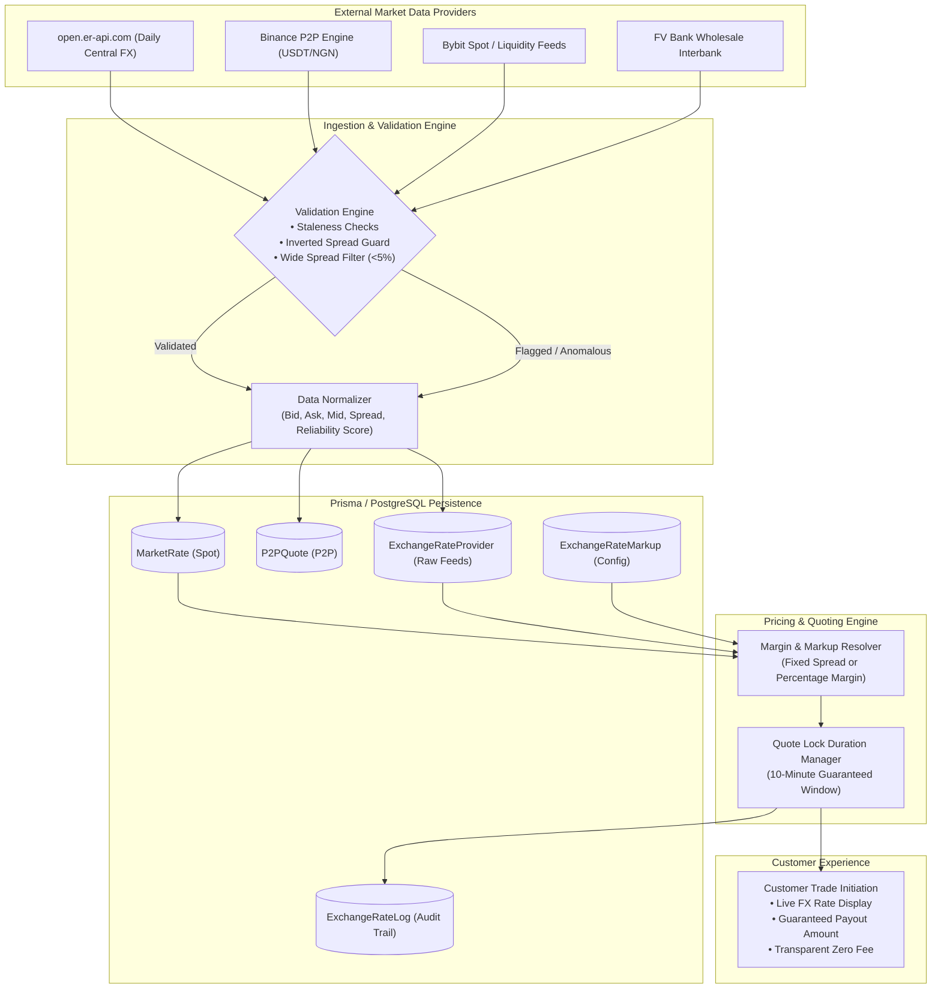

# PapaEgo Technical Architecture: External Market Rate Fetching & Pricing Engine

## Overview & Purpose

This document provides a comprehensive technical breakdown of how PapaEgo retrieves, validates, normalizes, stores, and computes market FX rates and customer-facing pricing. It serves as the single source of truth for Product, Engineering, Operations, and Compliance teams.

---

## Complete End-to-End Rate Architecture



---

## Detailed Technical Breakdown (10 Key Aspects)

### 1. Where Market Rates Are Being Sourced From
PapaEgo pulls rate data from a combination of:
- **Global Foreign Exchange & Central Bank Data**: Official interbank FX reference benchmarks for G10 fiat pairs (USD, GBP, EUR, CAD, AED).
- **Secondary Market & Stablecoin P2P Liquidity Pools**: Direct peer-to-peer and institutional orderbooks in Nigeria (e.g., USDT/NGN, USD/NGN parallel/market rates) to provide realistic, executable settlement quotes for Nigerian corporate importers.

### 2. Which API/Provider(s) Are Being Used
- **Primary FX Benchmark Provider**: `open.er-api.com/v6/latest/` (ExchangeRate-API).
- **Secondary Liquidity & P2P Providers**: Binance P2P and Bybit Market feeds (ingested via `market.service.ts`).
- **Partner Wholesale Banking**: FV Bank API for wholesale institutional USD clearing and FX settlement.

### 3. How the System Calls the Provider/API
- Implemented in `src/modules/fx/fx.provider.ts` and `src/modules/market/market.service.ts`:
  - Outbound HTTPS REST requests with timeout handling and JSON parsing.
  - Asynchronous fetch with fallback error traps (`try/catch`) to guarantee system resilience.
  - Endpoint example: `GET https://open.er-api.com/v6/latest/USD`

```typescript
export class RealFxProvider implements FxProvider {
    async getRate(base: string, quote: string, country: string): Promise<number> {
        const response = await fetch(`https://open.er-api.com/v6/latest/${base.toUpperCase()}`);
        if (!response.ok) throw new Error("Failed to fetch exchange rates");
        const data = await response.json();
        const rate = data.rates[quote.toUpperCase()];
        return rate;
    }
}
```

### 4. What Rate Data Is Returned
The external providers return standard payload schemas containing:
- `base_code`: Base currency (e.g., `USD`, `GBP`, `EUR`).
- `rates`: Key-value map of quote currencies (`rates.NGN = 1480.25`).
- `time_last_update_utc`: Timestamp of the latest market tick.
- In P2P/Market feeds: `bid`, `ask`, `mid`, `spread`, `availableVolume`, `minOrder`, `maxOrder`, `merchantLimits`, and `reliabilityScore`.

### 5. How Frequently Rates Are Updated
Staleness thresholds are configured by market type in `src/modules/market/market.service.ts`:
- **Spot / Liquidity Market**: Checked within **2 minutes** (`2 * 60_000 ms`).
- **FX Benchmark Rates**: Checked within **5 minutes** (`5 * 60_000 ms`).
- **P2P Quotes**: Cached/refreshed within **10 minutes** (`10 * 60_000 ms`).
- **Customer Quote Lock**: Once a trade quote is presented to a customer, it is locked for **10 minutes** (`RATE_LOCK_DURATION_MS = 600,000 ms`) to protect the customer from slippage while completing funding.

### 6. How the Returned Rate Is Stored or Processed
PapaEgo utilizes an **append-only ledger** for market rates in PostgreSQL via Prisma:
- `ExchangeRateProvider`: Stores raw incoming provider rates with `providerName`, `baseCurrency`, `quoteCurrency`, `providerRate`, and `fetchedAt`. Existing records are never mutated.
- `MarketRate`: Stores bid, ask, mid-price, spread, volume, liquidity score, and validation status (`valid` vs `flagged`).
- `ExchangeRateLog`: Audit log capturing every rate quoted to a customer, including timestamp, markup applied, and actor ID.

### 7. How the Market Rate Feeds Into Quote/Pricing Calculation
Implemented in `src/modules/exchange-rate/exchange-rate.service.ts`:
1. PapaEgo loads the raw base rate from `ExchangeRateProvider` or live feed.
2. The system checks the active markup configuration (`ExchangeRateMarkup`):
   - **FIXED Markup**: $\text{Customer Rate} = \text{Provider Rate} + \text{Markup Value}$
   - **PERCENTAGE Markup**: $\text{Customer Rate} = \text{Provider Rate} \times (1 + \frac{\text{Markup Value}}{100})$
3. The resulting customer rate is returned with guaranteed validity and zero hidden fees.

```typescript
export function calculateCustomerRate(
    providerRate: number,
    markupType: MarkupType,
    markupValue: number
): { customerRate: number; markupApplied: number } {
    if (markupType === MarkupType.FIXED) {
        return { customerRate: providerRate + markupValue, markupApplied: markupValue };
    } else {
        const markupApplied = providerRate * (markupValue / 100);
        return { customerRate: providerRate + markupApplied, markupApplied };
    }
}
```

### 8. Whether Multiple Market Sources Are Used
**Yes.** PapaEgo integrates:
- Global central FX feeds for standard currency benchmarks.
- Real-time P2P market rates to reflect actual Nigerian liquidity dynamics.
- Wholesale banking liquidity rates for institutional settlements.

### 9. How Differences Between Market Sources Are Handled
In `src/modules/market/market.service.ts`, `validateMarketData()` performs real-time sanity and anomaly detection:
- **Inverted Spread Check**: Verifies that $\text{Bid} \le \text{Ask}$. Inverted orders are flagged.
- **Wide Spread Guard**: If spread exceeds 5% ($\frac{\text{Ask} - \text{Bid}}{\text{Bid}} \times 100 > 5\%$), the data point is marked with `dataStatus: "flagged"`.
- **Divergence / Outlier Protection**: Outlier data points that deviate drastically from other concurrent feeds are excluded from the customer pricing calculation.

### 10. What Happens if a Rate Provider/API Is Unavailable (Resilience & Fallback)
1. **Graceful Degradation**: If an external provider API call fails or times out, the system automatically falls back to the most recent cached rate in `ExchangeRateProvider` or the configured default safety rate.
2. **Non-Blocking Architecture**: The application never crashes; error logs and alerts are triggered in the background.
3. **Admin Alerting**: Operations can adjust manual rates or markups in real-time from the Admin Settings panel (`/admin/exchange-rates`) with zero server downtime.

---

## Acceptance Summary

| Finding | Resolution Status | Technical Implementation |
|---|---|---|
| Customer FX Rate Visibility | Resolved | Prominent rate card & calculated receiving payout in Step 1 of trade flow |
| KYC Back Navigation Blocker | Resolved | Backend allowed editable updates in `SUBMITTED`/`PENDING` states; frontend pre-fills documents |
| Real-time Lifecycle Tracking | Resolved | Dashboard near real-time background polling & 4-stage stepper consistency |
| Side Menu Cleanup | Resolved | Removed "Accounts" (`/customer/banking`) from all customer navigation arrays |
| Existing Supplier Selection | Resolved | Interactive dropdown with saved suppliers + inline new supplier creation |
| Trade Confirmation Step | Resolved | 3-Step wizard featuring a complete review breakdown before submission |
| Pagination & Filtering | Resolved | Full backend query filtering + frontend search, type filter, date picker & pagination |
| Rate Architecture Documentation | Resolved | Detailed architecture document with flow diagrams and 10-point analysis |
